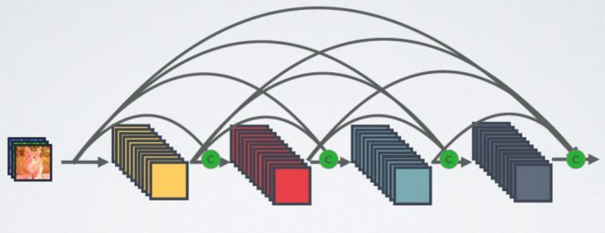
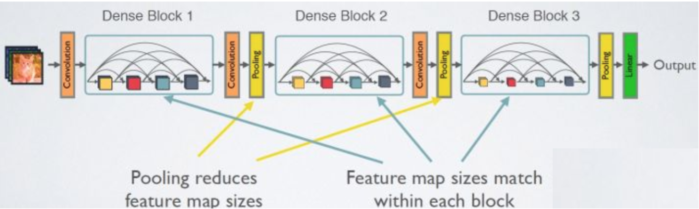
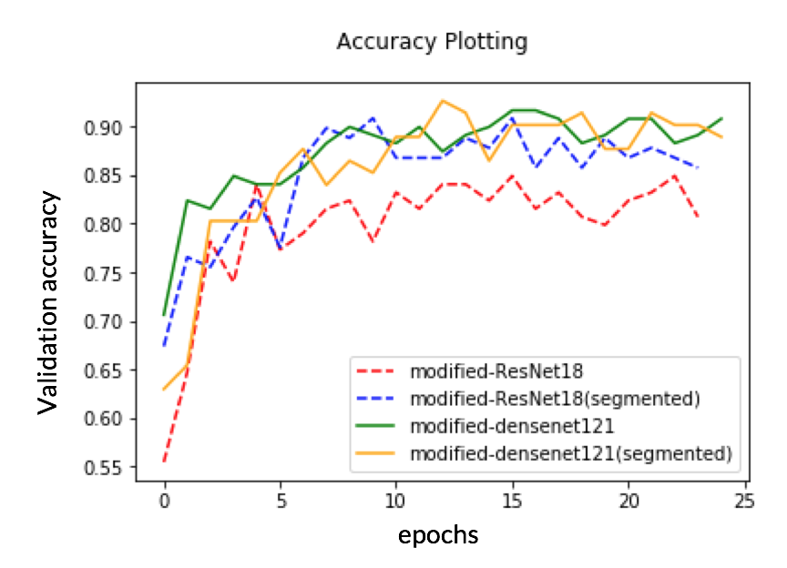

# Ventilator Pressure Prediction

## Team Members: 
Anamika Kumari, Ashay Aglawe, Kratika Shetty, Murlidhar Koripalli

## Background and Motivation
Ventilators have proven to be a lifesaver during the pandemic. However, mechanical ventilation is a clinician-intensive procedure, a limitation that was prominently on display during the early days of the COVID-19 pandemic.

A traditional pressure controlled ventilator lets air in and out of a patient’s lungs according to airway pressures specified by a clinician. These hand-tuned PID controllers and similar variants have dominated the industry for decades but these are very unreliable, overshooting or undershooting their values or fluctuating very fast. Hence a data driven machine learning approach can be considered as an alternative solution. The goal of the project, which is also a Kaggle competition, is to predict the airway pressure in the respiratory circuit during the breath given the time series of control inputs. We aim to develop a model that self-regulates as per the patient’s vital in real-time which can lead to future development of intelligent ventilators.

## Dataset
### Ventilator Data
The ventilator data used in this competition was provided by [Kaggle](https://www.kaggle.com/c/ventilator-pressure-prediction/data) and was produced using a modified [open-source ventilator](https://www.peoplesvent.org/en/latest/) connected to an [artificial bellows test lung](https://www.ingmarmed.com/product/quicklung/) via a respiratory circuit.

### Columns

| Column |Description|
|-------|--------|
| id | Globally unique time step identifier across an entire file |
| breath_id | Globally unique time step for breaths | 
| R | Lung attribute indicating how restricted the airway is (in cmH2O/L/S) |
| C | Lung attribute indicating how compliant the lung is (in mL/cmH2O). Physically, this is the change in volume per change in pressure |
| time_step | The actual time stamp | 
| u_in | The control input for the inspiratory solenoid valve. Ranges from 0 to 100 | 
| u_out | The control input for the exploratory solenoid valve. Either 0 or 1 |
| pressure | The airway pressure measured in the respiratory circuit, measured in cmH2O |

## Exploratory Data Analysis

## Preprocessing
### Data Preparation
Since the original dataset is not well normalized, Each image is cropped to 224 * 224 pixels resolution and RGB color theme.
For future classification task, three subsets are created as follow:

**trainingSet** 4750 RGB labeled images with 224\*224 resolution  

**sampleSet** 2371 RGB labeled images with 224\*224 resolution

**testSet** 794 RGB unlabeled images with 224\*224 resolution

After these process, here are several examples:

Since this project will performed on ResNet and DenseNet using Pytorch, the final outputs are transformed into tensor format by Pytorch. For the size purpose, the output is not uploaded, but the [data loader](https://github.com/WeinanZhi/-CS539-PlantSeedPrediction/blob/master/data_loader.ipynb) can do the job in no time and write the output to the current working directory.

The final output should consists of the following five files: 

**sample_X.pt** 2371 tensors corresponding to sampleSet 2371 images

**train_X.pt** 4750 tensors corresponding to trainingSet 4750 images

**test.pt** 794 tensors corresponding to testSet 794 images

**sample_Y.txt** 2371 labels corresponding to sample_X.pt 2371 tensors

**train_Y.txt** 4750 labels corresponding to train_X.pt 4750 tensors

### Data Segmentation
[Segmented Data](https://drive.google.com/drive/folders/19Px2relPjxfPZWV7UGHchqaqXX8RZBRc?usp=sharing)

Outside datasets similar to original datasets have been used for better accuracy. Here is an example:

Segmentation Result:

## Transfer Learning of Image Classification

We used two models, one is ResNet18, the other is DensNet121.

## ResNet18 MOdel

## DenseNet121 Model
The second model we used is DenseNet121 Model.
Compared with RESNET, densenet proposes a more radical dense connection mechanism. That is, all layers are connected to each other, especially, each layer will accept all the previous layers as its additional input.

The network structure of densenet is mainly composed of denseblock and transition. In denseblock, each layer has the same characteristic map size and can be connected in the channel dimension.

## Experiments

GPU: Google Colab

Epochs: 25

Unsegmented data set

Segmented data set

Batch size:4

## Conclusion
We plot all the accuracy in one linechart as below, and get three conclusion.
1. Segmented data performed  better on ResNet18.
2. Segmented data  and original data performed  almost same  on Densenet121.
3. Densenet121 performed better than ResNet18 because of the complicated input structure.

